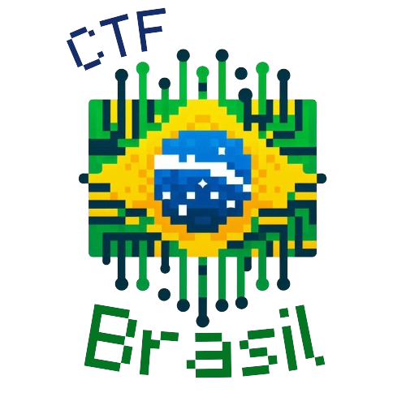

# CTF-Brasil-2024  

Bem-vindo ao repositório CTF Brasil 2024! Este repositório foi criado com o objetivo de centralizar informações sobre competições de Capture The Flag (CTF) no Brasil, fornecendo uma plataforma para que a comunidade se mantenha atualizada sobre as próximas competições, compartilhe recursos e desenvolva habilidades na área de segurança da informação.

## Sobre
Capture The Flag (CTF) é uma competição de segurança da informação onde os participantes enfrentam desafios que envolvem hacking, engenharia reversa, criptografia, entre outros. O CTF Brasil 2024 visa promover a comunidade de segurança da informação no Brasil, oferecendo um espaço para aprendizado, colaboração e competição saudável.

## Código de conduta
Antes de contribuir para o CTF Brasil 2024, pedimos que todos os participantes sigam nosso [Código de Conduta](). Este documento estabelece diretrizes para garantir um ambiente seguro, inclusivo e respeitoso para todos os membros da comunidade. A violação destas diretrizes não será tolerada e pode resultar em medidas disciplinares.

## Como contribuir?
Valorizamos e incentivamos contribuições de todos os membros da comunidade para o CTF Brasil 2024. Se você deseja contribuir, por favor, leia nosso [Guia de Contribuição]() para obter informações sobre como enviar suas contribuições de forma eficaz. Seja através da adição de campeonatos, melhoria da documentação ou qualquer outra forma de contribuição, todas as ajudas são bem-vindas e apreciadas.

Obrigado por ajudar a tornar o CTF Brasil 2024 uma plataforma vibrante e colaborativa para a comunidade de segurança da informação no Brasil.